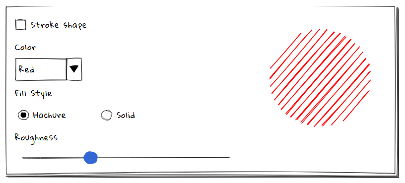

# 手绘组件

## 安装
> - 全部安装 npm i -S wired-elements
> - 按需安装 npm i -S wired-button
## 使用
```
import { WiredButton } from "wired-button"
//加入到render里面
<wired-button>Click Me</wired-button>
<wired-button disabled>Disabled</wired-button>
<wired-button elevation="3">Elevation</wired-button>
```